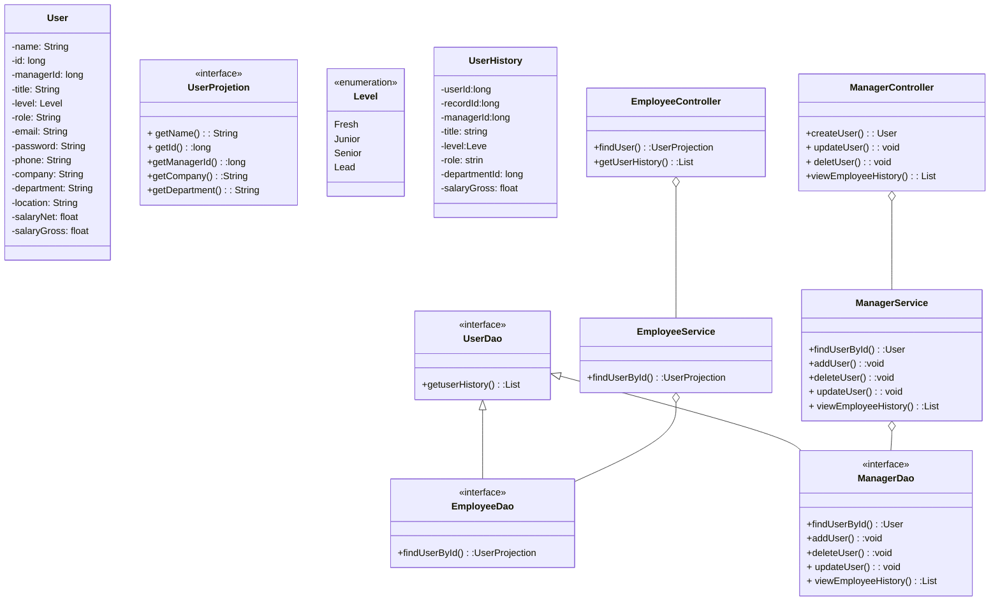
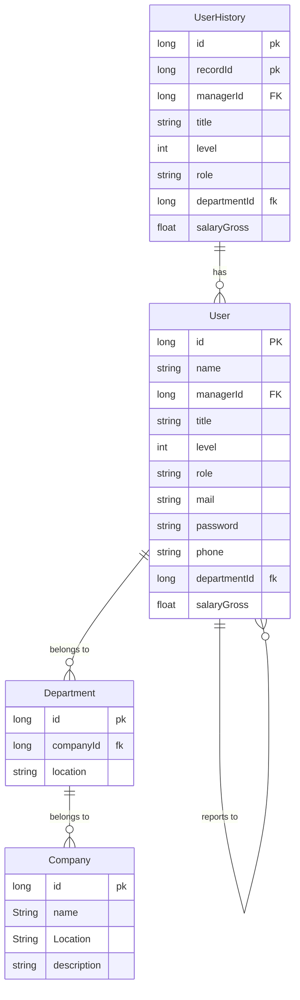
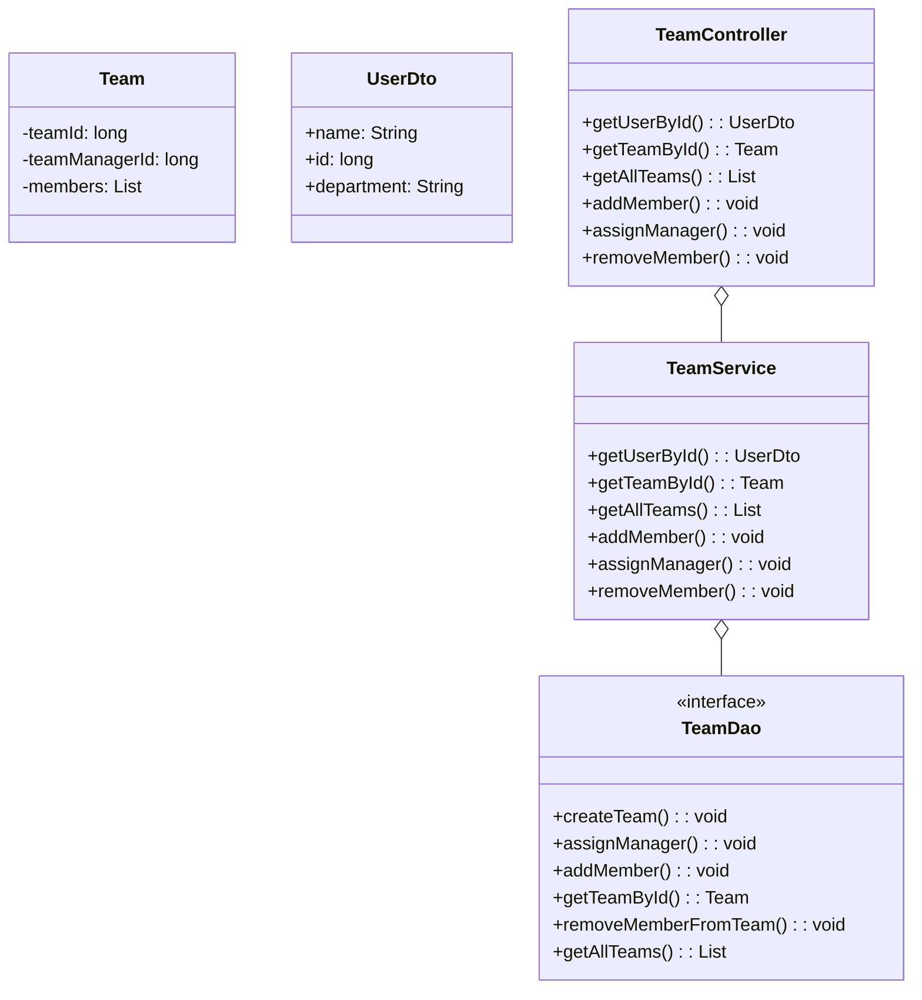
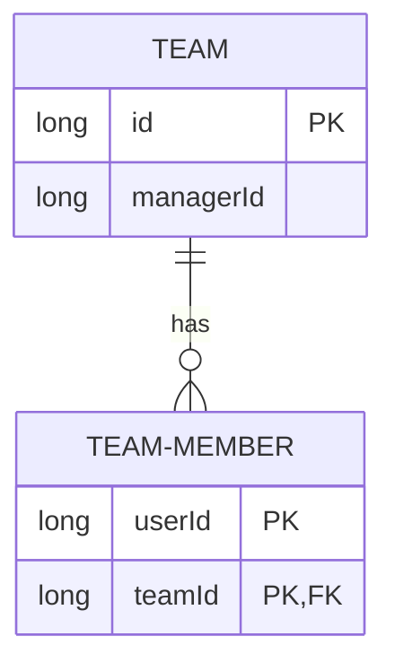
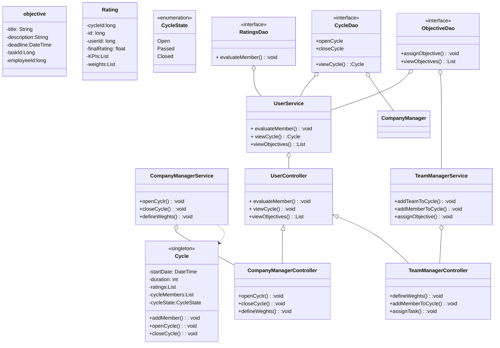
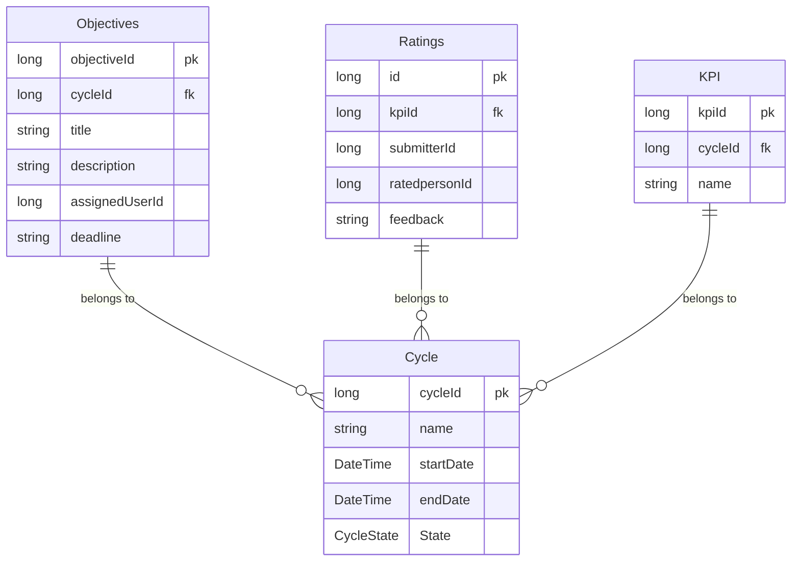
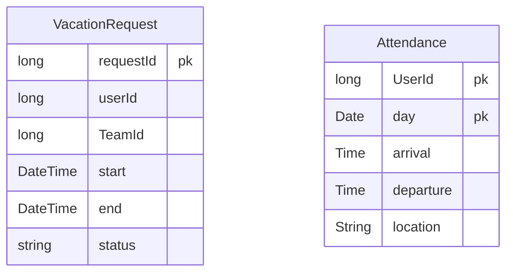

###                  Company Managment System
## User-API
# UML

```mermaid
classDiagram
class User{
-name: String
-id: long
-managerId: long
-title: String
-level: Level
-role: String
-email: String
-password: String
-phone: String
-company: String
-department: String
-location: String
-salaryNet: float
-salaryGross: float
}
class UserProjetion{
 <<interface>>
+ getName(): String
+ getId():long
+getManagerId():long
+getCompany():String 
+getDepartment(): String
}
class Level{
<<enumeration>>
Fresh
Junior
Senior
Lead
}
class UserHistory{
-userId:long
-recordId:long
-managerId:long
-title: string
-level:Leve
-role: strin
-departmentId: long
-salaryGross: float
}
class UserDao{
<<interface>>
+getuserHistory():List<User>
}
class EmployeeDao{
<<interface>>
+findUserById():UserProjection
}
class ManagerDao{
<<interface>>
+findUserById():User
+addUser():void
+deleteUser():void
+ updateUser(): void
+ viewEmployeeHistory():List<User>
}

class EmployeeService{
+findUserById():UserProjection
}
class ManagerService{
+findUserById():User
+addUser():void
+deleteUser():void
+ updateUser(): void
+ viewEmployeeHistory():List<User>
}
class EmployeeController{
+findUser():UserProjection
+getUserHistory():List<User>
}
class ManagerController{
+createUser(): User
+ updateUser(): void
+ deletUser(): void
+viewEmployeeHistory(): List<User>
}
UserDao <|--EmployeeDao
UserDao <|--ManagerDao
ManagerService o-- ManagerDao
EmployeeService o-- EmployeeDao
ManagerController o-- ManagerService
EmployeeController o-- EmployeeService


```
# ERD

```mermaid
erDiagram
User {
        long id PK
        string name
        long managerId FK
        string title
        int level
        string role
        string mail
        string password
        string phone
        long departmentId fk
        float salaryGross
    }
    Company{
        long id  pk
        String name  
        String Location
        string description
        }
    Department{
          long id pk
          long companyId fk
          string location
    }
    UserHistory{
        long id pk
        long recordId pk
       long managerId FK
        string title
        int level
        string role
        long departmentId fk
        float salaryGross
}
User ||--o{ Department : "belongs to"
Department ||--o{ Company : "belongs to"
User ||--o{ User : "reports to"
UserHistory ||--o{ User : "has"

```
## Team API 
# UML 

```mermaid
classDiagram
class Team {
  -teamId: long
  -teamManagerId: long
  -members: List
}

class UserDto {
  +name: String 
  +id: long
  +department: String
}

class TeamDao {
  <<interface>>
  +createTeam(): void 
  +assignManager(): void
  +addMember(): void
  +getTeamById(): Team
  +removeMemberFromTeam(): void
  +getAllTeams(): List<Team>
}

class TeamService {
  +getUserById(): UserDto
  +getTeamById(): Team
  +getAllTeams(): List<Team>
  +addMember(): void
  +assignManager(): void
  +removeMember(): void
}

class TeamController {
  +getUserById(): UserDto
  +getTeamById(): Team
  +getAllTeams(): List<Team>
  +addMember(): void
  +assignManager(): void
  +removeMember(): void
}

TeamService o-- TeamDao
TeamController o-- TeamService

```
# ERD

```mermaid
erDiagram
    TEAM {
        long id PK
        long managerId
    }
    TEAM-MEMBER {
        long userId PK
        long teamId PK, FK
    }
    TEAM ||--o{ TEAM-MEMBER : has
```
## Evaluation API 
# UML

```mermaid
classDiagram
class Cycle{
<<singleton>>
-startDate: DateTime
-duration: int 
-ratings:List<float>
-cycleMembers:List<User>
-cycleState:CycleState
+addMember(): void
+openCycle(): void
+closeCycle(): void
}
class objective{ 
-title: String
-description:String
-deadline:DateTime
-taskId:Long
-employeeId:long
}
class Rating{ 
-cycleId:long
-id: long 
-userId: long
-finalRating: float
-KPIs:List<int>
-weights:List<float>
}
class CycleState{ 
<<enumeration>> 
Open
Passed 
Closed
}
class CycleDao{
<<interface>>
+openCycle
+closeCycle
+viewCycle():Cycle
}
class RatingsDao{
<<interface>>
+ evaluateMember():void
}
class ObjectiveDao{
<<interface>>
+assignObjective():void
+viewObjectives():List<Objective>
}
class UserService{
+ evaluateMember():void
+ viewCycle():Cycle
+viewObjectives():List<objective>

}
class CompanyManagerService{
+openCyclr():void
+closeCycle():void
+defineWeghts():void
}
class TeamManagerService{
+addTeamToCycle():void
+addMemberToCycle():void
+assignObjective():void
}
class UserController{
+ evaluateMember():void
+ viewCycle():void
+viewObjectives():List<objectives>
}
class CompanyManagerController{
+openCyclr():void
+closeCycle():void
+defineWeghts():void
}
class TeamManagerController{
+defineWeghts():void
+addMemberToCycle():void
+assignTask():void
}

UserController <|--CompanyManagerController
UserController <|--TeamManagerController
CompanyManagerService o-- CompanyManagerController
UserService o-- UserController
TeamManagerService o-- TeamManagerController
CycleDao o-- UserService
RatingsDao o-- UserService
ObjectiveDao o-- UserService
ObjectiveDao o-- TeamManagerService
CycleDao o-- CompanyManager
CompanyManagerService ..>Cycle


```

# ERD

```mermaid
erDiagram
Cycle{
long cycleId pk
string name
DateTime startDate
DateTime endDate
CycleState State
}
KPI{
long kpiId pk
long cycleId fk
string name
}
Ratings{
long id pk
long kpiId fk
long submitterId
long ratedpersonId
string feedback
}
Objectives {
    long objectiveId pk
    long cycleId fk
    string title
    string description
    long assignedUserId 
    string deadline
  }
Objectives ||--o{Cycle : "belongs to"
Ratings ||--o{Cycle : "belongs to"
KPI ||--o{Cycle : "belongs to" 
```
## Attendance API 

# ERD

```mermaid
erDiagram
VacationRequest{
long requestId pk
long userId
long TeamId
DateTime start
DateTime end
string status
}
Attendance{
long UserId pk 
Date day pk
Time arrival
Time departure 
String location
}
```

        
          
