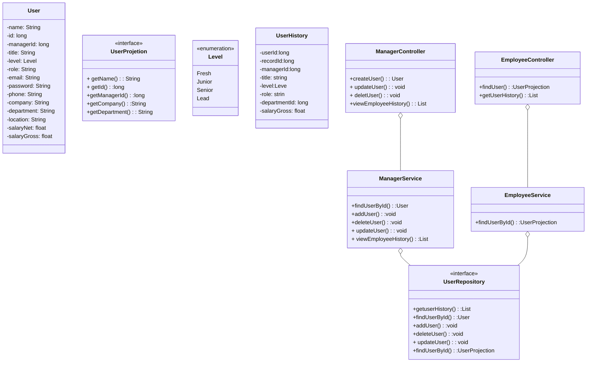
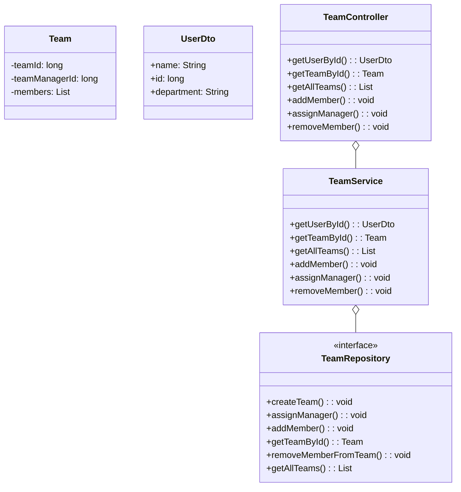
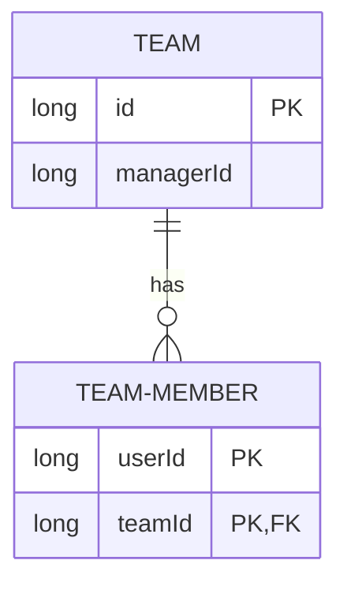
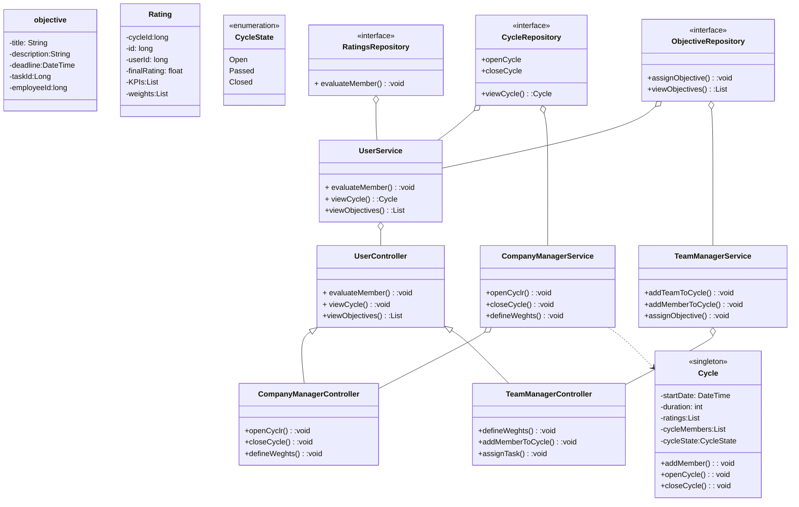
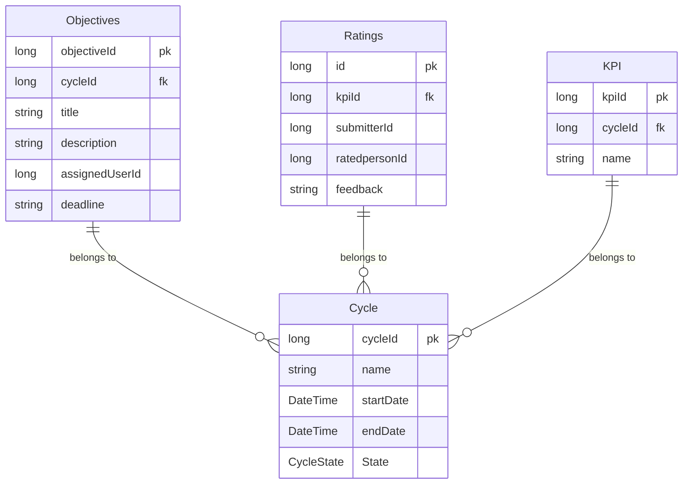
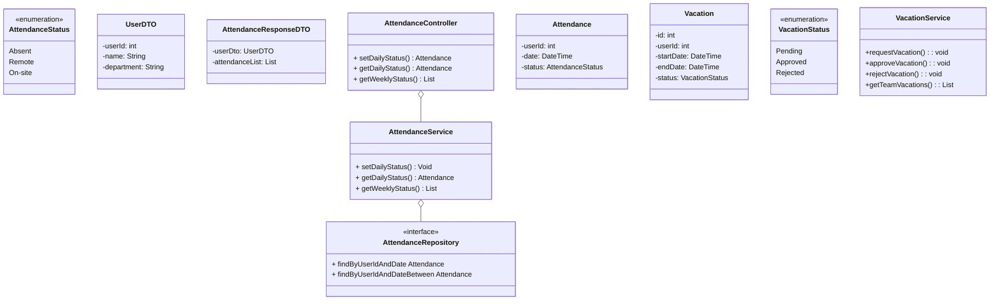
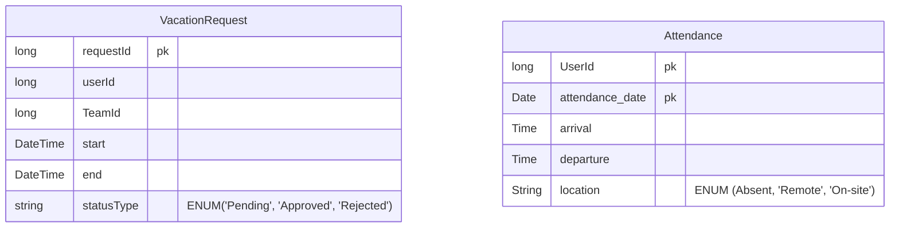
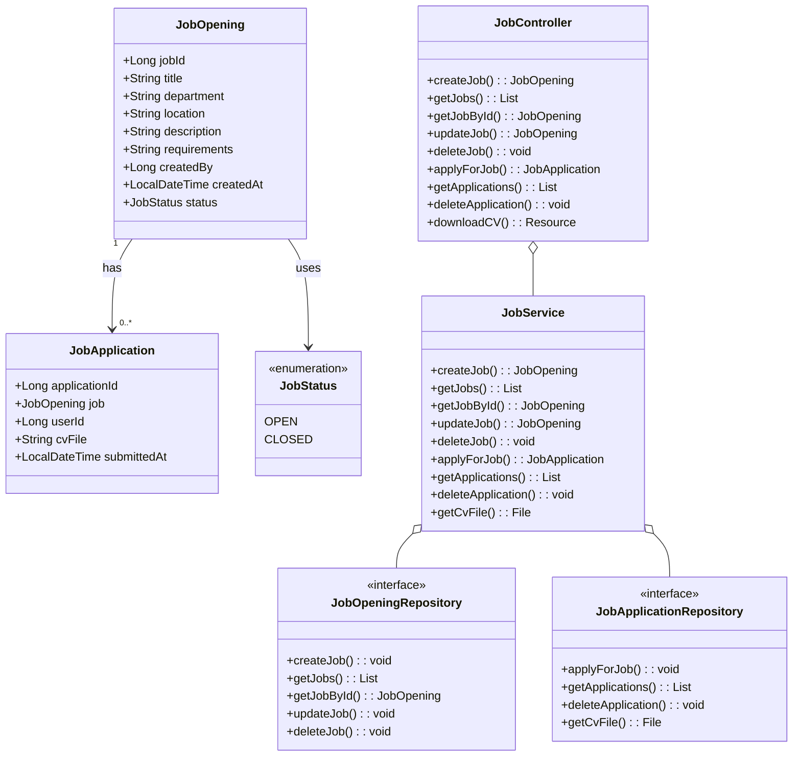
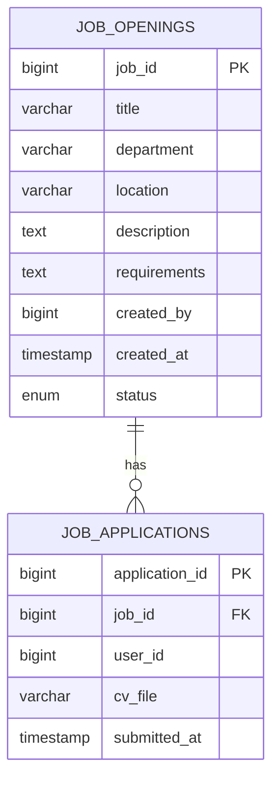

###                  Company Managment System
## User-API
# UML

# ERD

## Team API 
# UML 

# ERD

## Evaluation API 
# UML

# ERD

## Attendance API 
# UML

# ERD

## Hiring API
# UML

# ERD

